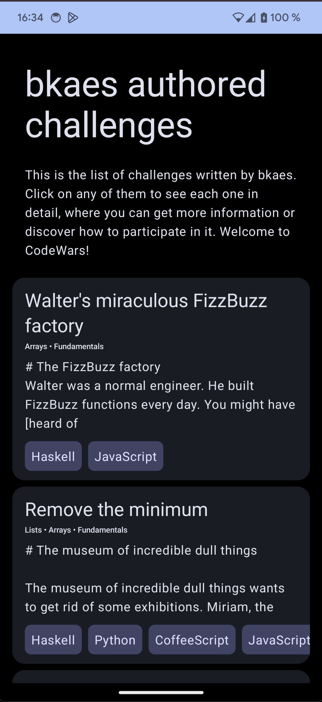
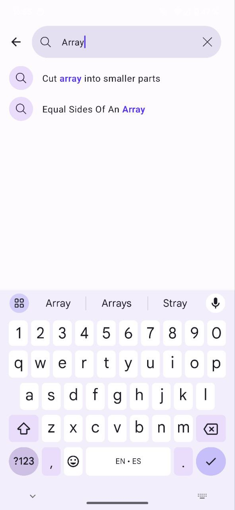
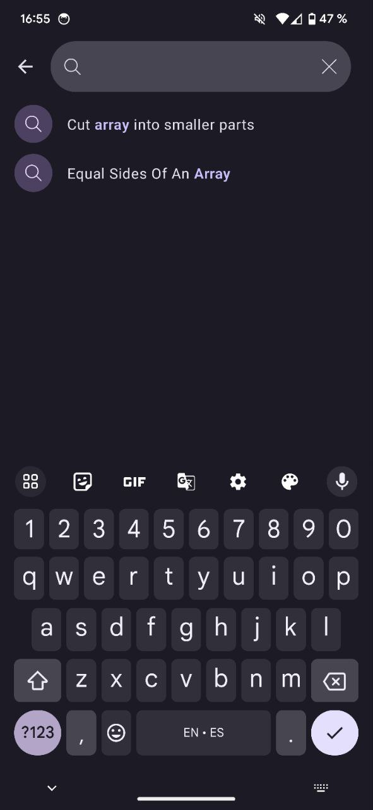

## Project Description

This project utilizes the [Codewars API](https://dev.codewars.com/#introduction) to showcase challenges created by a user. The challenges are presented in the form of a list, along with a detailed view for each challenge that provides expanded information.

### Features

- Display of challenges created by a user.
- List view for easy navigation.
- Detailed challenge information on a separate screen.
- Search

### Screenshots

|        | Light Theme                                   | Dark Theme                                   |
|--------|-----------------------------------------------|----------------------------------------------|
| List   |    |    |
| Detail |  |  |
| Search |  |  |

### Requirements

- Android Studio Giraffe (Latest Build 2022.3.1 Patch 1)
- Set JAVA_11 JDK on Android Studio Settings > Build, Execution, Deployment > Build Tools > Gradle 

#### Project features

- Clean Architecture.
- Model View ViewModel.
- Utilization of Coroutines and Flows.
- Jetpack Compose.
- Dependency Injection with Dagger2 and Hilt + Assisted Injection.
- Multi-module Approach.
- Jetpack Navigation Library.
- Dynamic Theming with Material3.
- Offline Capabilities.
- Unit Testing.
- Room.
- Retrofit.
- Gradle Kotlin DSL.
- Gradle Version Catalogs.
- Gradle Precompiled Scripts

## Modularization and Modules

The project is notably modularized, with the following prominent modules:

### `:entity`

This module houses the application's domain entities. Since the project is relatively simple, it currently only contains entities. However, if there were business logic, it could also be stored in this module.

### `:app`

This module implements the Android application, utilizing other feature and project modules. It's capable of injecting implementation details from other modules, thanks to dependency injection, Dagger2 + Hilt.

### `:common-network`

Implementing certain `okhttp3.Interceptors` for the network layer, this module allows these interceptors to be applied to other network related modules. If more hypothetical features were to implement different web services, common interceptors like authentication could be stored here, among other shared network setup.

### `:common:repository`

This module provides a general implementation for data persistence in the form of caching using repositories. It's designed to facilitate offline experiences in the data layer for different features.

### `:common:codewars-design-system`

True to its name, this module stores the design system configuration to be used by other modules or features. It integrates Material 3 and Dynamic Color.

### `:common:android:navigation-contract`

Opting for the use of the navigation library with Jetpack Compose integration, navigation exclusively occurs through routes. This module contains all the information on how to navigate between different screens and their associated arguments.

### `:feature:challenges:model`

Containing the data layer to be used by the challenges feature, this module includes both network and data persistence components to offer an offline experience.

### `:feature:challenges`

Implementing the presentation layer for the challenges feature, this module comprises two screens: `AuthoredChallengesScreen.kt` and `ChallengeDetailScreen.kt`.

## Offline

All API requests are stored in a local database to persist the information for a duration of four hours. The implementation can be found in the `CachingRepository<T,Q>` class within the `:common:repository` module.

This approach makes it particularly straightforward to create repositories for various features, simply by utilizing dependency injection.

> [`ChallengeModule.kt`](https://github.com/saulmm/codewars/blob/3efc3474655133fc950ba3f5a2af5d5739eb0e6f/feature/challenges/model/src/main/java/com/saulmm/feature/challenges/model/di/ChallengeModelModule.kt)
```kotlin
@Module
@InstallIn(SingletonComponent::class)
internal class ChallengeModelModule {

    @Provides
    @Singleton
    fun provideChallengePreviewRepository(
        remote: ChallengesPreviewApiDataSource,
        local: ChallengesPreviewRoomDataSource,
    ): Repository<ChallengePreviewParams, List<Challenge>> {
        return CachingRepository(
            remote = remote,
            local = local
        )
    }


    @Provides
    @Singleton
    fun provideChallengeDetailRepository(
        remote: ChallengeDetailApiDataSource,
        local: ChallengeDetailRoomDataSource,
    ): Repository<ChallengeDetailParams, ChallengeDetail> {
        return CachingRepository(
            remote = remote,
            local = local
        )
    }

}
```

### Known Issues

- I am aware that the performance of the challenges list can be improved. I have attempted to debug recompositions and researched an issue related to Modifiers, the internal `composable()` API, and the `.clickable {}` modifier. With a bit more time, I would prioritize enhancing the performance.

  For more information, you can refer to the following resources:

    - [Solving the Mystery of Recompositions in Compose's LazyList](https://blog.shreyaspatil.dev/solving-the-mystery-of-recompositions-in-composes-lazylist)
    - [What's New in Jetpack Compose - August '23 Release](https://android-developers.googleblog.com/2023/08/whats-new-in-jetpack-compose-august


- Additionally, I'm conscious that on the detail screen, when rendering certain descriptions in Markdown and under dark themes, some elements might not have sufficient contrast. Given more time, I would debug and add the appropriate styling to the richtext library.
